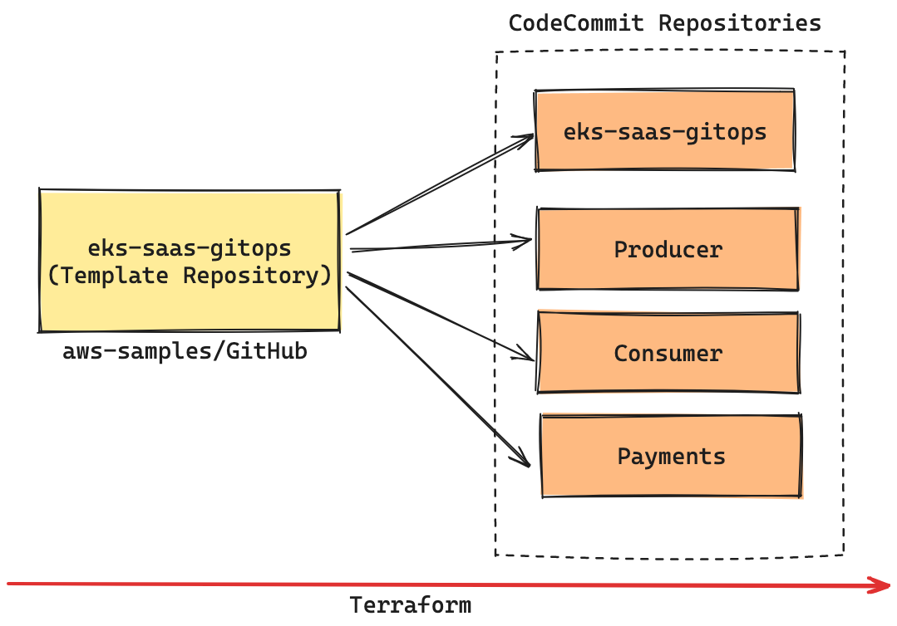

# Guidance for EKS SaaS GitOps

## Table of Contents

1. [Overview](#overview)
   - [Features and Benefits](#features-and-benefits)
   - [Use cases](#use-cases)
   - [Architecture](#architecture-overview)
   - [AWS services in this Guidance](#aws-services-in-this-guidance)
   - [Cost](#cost)
2. [Prerequisites](#prerequisites)
   - [Supported AWS Regions](#supported-aws-regions)
   - [Quotas](#quotas)
3. [Deployment Steps](#deployment-steps)
4. [License](#license)

## Overview

The EKS SaaS GitOps Workshop provides a comprehensive template for implementing GitOps practices in a multi-tenant SaaS environment using Amazon EKS. This repository serves as a foundation to generate multiple component repositories, enabling a hands-on GitOps experience. It provides all the necessary patterns, configurations, and scripts to deploy a scalable SaaS application.

This guidance addresses the following key points:

- Provides a simplified process for setting up a GitOps workflow for SaaS applications on EKS
- Includes pre-configured templates and scripts for tenant onboarding and management
- Aims to reduce the learning curve associated with implementing GitOps in a SaaS context
- Allows users to focus on SaaS-specific concerns rather than infrastructure setup

The motivation behind this project is to accelerate and simplify the process of implementing GitOps practices in a SaaS environment. We've heard from customers that there can be a learning curve associated with deploying multi-tenant applications using GitOps principles. This project aims to simplify the undifferentiated lifting, allowing you to focus on your SaaS business logic.

## Features and Benefits

1. **Automated Tenant Onboarding**: Streamline the process of adding new tenants to your SaaS application with automated workflows and GitOps principles.

2. **Multi-Repository Structure**: Leverage a well-organized multi-repository structure that separates concerns and enables independent deployment of components.

3. **Environment-Specific Customization**: Easily tailor configurations for different environments (dev, staging, prod), enabling flexible and consistent multi-environment setups.

4. **Integrated Microservices**: Benefit from pre-integrated microservices templates that demonstrate communication patterns in a multi-tenant environment.

5. **Best Practices Implementation**: Automatically apply AWS, Kubernetes, and GitOps best practices, enhancing security, performance, and operational efficiency.

6. **Terraform-Based Deployment**: Utilize Terraform for infrastructure-as-code deployment, ensuring reproducibility and easier management of configurations across environments.

## Use Cases

1. **Accelerating SaaS Application Development on Kubernetes**
   Streamlining the development and deployment of multi-tenant applications on Amazon EKS using GitOps principles.

2. **Implementing Tenant Isolation in SaaS Applications**
   Demonstrating patterns for secure tenant isolation within a shared Kubernetes infrastructure.

3. **Automating Tenant Onboarding Workflows**
   Providing automated processes for adding new tenants to a SaaS application with minimal manual intervention.

4. **Consistent Multi-Environment Setup for SaaS Applications**
   Facilitating uniform deployments across dev, staging, and production for multi-tenant applications.

5. **Adopting GitOps for SaaS Application Management**
   Implementing GitOps methodologies for managing the lifecycle of SaaS applications on Kubernetes.

## Architecture Overview

This repository is organized to facilitate a hands-on learning experience, structured as follows:

- **`/gitops`**: Contains GitOps configurations and templates for setting up the application plane, clusters, control plane, and infrastructure necessary for the SaaS architecture.
- **`/helpers`**: Includes CloudFormation templates to assist in setting up the required AWS resources. (Used for deploying a VSCode server instance needed for setup)
- **`/helm-charts`**: Houses Helm chart definitions for deploying tenant-specific resources within the Kubernetes cluster and shared services resources.
- **`/tenant-microservices`**: Contains the source code and Dockerfiles for the sample microservices used in the workshop (consumer, payments, producer).
- **`/terraform`**: Features Terraform modules and scripts for provisioning the AWS infrastructure and Kubernetes resources. Detailed setup instructions are provided within this folder's README.md.
- **`/workflow-scripts`**: Provides scripts to automate the workflow for tenant onboarding and application deployment within the GitOps framework.

### Architecture Diagram



*Figure 1: EKS SaaS GitOps Repository Structure*

### Architecture Steps

1. Admin/DevOps engineer sets up the initial infrastructure using Terraform scripts provided in the `/terraform` directory.

2. The GitOps configurations in the `/gitops` directory are used to establish the continuous deployment pipeline.

3. Helm charts from the `/helm-charts` directory are deployed to configure both shared services and tenant-specific resources.

4. Sample microservices from the `/tenant-microservices` directory demonstrate the multi-tenant application architecture.

5. Tenant onboarding is automated using scripts from the `/workflow-scripts` directory, which create tenant-specific repositories and configurations.

### AWS services in this Guidance

| **AWS Service** | **Role** | **Description** |
|-----------------|----------|-----------------|
| Amazon EKS | Core service | Manages the Kubernetes control plane and worker nodes for container orchestration. |
| Amazon EC2 | Core service | Provides the compute instances for EKS worker nodes and runs containerized applications. |
| Amazon VPC | Core Service | Creates an isolated network environment with public and private subnets across multiple Availability Zones. |
| Amazon ECR | Supporting service | Stores and manages Docker container images for EKS deployments. |
| AWS IAM | Supporting service | Manages access to AWS services and resources securely, including EKS cluster access. |
| AWS CodeBuild | CI/CD service | Compiles source code, runs tests, and produces software packages ready for deployment. |
| AWS CodePipeline | CI/CD service | Automates the build, test, and deployment phases of your release process. |
| AWS Systems Manager | Management service | Provides operational insights and takes action on AWS resources. |
| AWS Key Management Service | Security service | Manages encryption keys for securing data in EKS and other AWS services. |

## Cost

You are responsible for the cost of the AWS services used while running this guidance. 
As of May 2025, the cost for running this guidance with the default settings in the US East (N. Virginia) Region is approximately **$414.71/month**.

We recommend creating a [budget](https://alpha-docs-aws.amazon.com/awsaccountbilling/latest/aboutv2/budgets-create.html) through [AWS Cost Explorer](http://aws.amazon.com/aws-cost-management/aws-cost-explorer/) to help manage costs. Prices are subject to change. For full details, refer to the pricing webpage for each AWS service used in this guidance.

### Sample cost table

The following table provides a sample cost breakdown for deploying this guidance with the default parameters in the `us-east-1` (N. Virginia) Region for one month. This estimate is based on the AWS Pricing Calculator output for the full deployment as per the guidance.

| **AWS service** | Dimensions | Cost, month [USD] |
|-----------------|------------|-------------------|
| Amazon EKS | 1 cluster | $73.00 |
| Amazon VPC | 2 NAT Gateways | $65.78 |
| Amazon EC2 | 2 m6g.large instances | $112.42 |
| Amazon EC2 | 1 t3.large instance (VSCode Server) | $60.74 |
| Amazon EC2 | 1 t2.micro instance (Gitea) | $8.47 |
| Amazon ECR | Image storage and data transfer | $10.00 |
| Amazon EBS | gp2 storage volumes and snapshots | $17.97 |
| Application Load Balancer | 1 ALB for workloads | $16.66 |
| Amazon VPC | Public IP addresses | $3.65 |
| AWS Key Management Service (KMS) | Keys and requests | $7.00 |
| Amazon CloudWatch | Metrics | $3.00 |
| AWS Systems Manager | Parameter Store and automation | $36.02 |
| **TOTAL** |  | **$414.71/month** |

For a more accurate estimate based on your specific configuration and usage patterns, we recommend using the [AWS Pricing Calculator](https://calculator.aws).

## Supported AWS Regions

The core components of the Guidance for EKS SaaS GitOps are available in all AWS Regions where Amazon EKS is supported.

The observability components of this guidance use Amazon Managed Service for Prometheus (AMP) and Amazon Managed Grafana (AMG). These services are available in the following regions:

| Region Name | Region Code |
|-------------|-------------|
| US East (N. Virginia) | us-east-1 |
| US East (Ohio) | us-east-2 |
| US West (Oregon) | us-west-2 |
| Asia Pacific (Mumbai) | ap-south-1 |
| Asia Pacific (Seoul) | ap-northeast-2 |
| Asia Pacific (Singapore) | ap-southeast-1 |
| Asia Pacific (Sydney) | ap-southeast-2 |
| Asia Pacific (Tokyo) | ap-northeast-1 |
| Europe (Frankfurt) | eu-central-1 |
| Europe (Ireland) | eu-west-1 |
| Europe (London) | eu-west-2 |
| Europe (Paris) | eu-west-3 |
| Europe (Stockholm) | eu-north-1 |
| South America (São Paulo) | sa-east-1 |


### Regions Supporting Core Components Only

The core components of this Guidance can be deployed in any AWS Region where Amazon EKS is available. This includes all commercial AWS Regions except for the China Regions and the AWS GovCloud (US) Regions.

For the most current availability of AWS services by Region, refer to the [AWS Regional Services List](https://aws.amazon.com/about-aws/global-infrastructure/regional-product-services/).

Note: If you deploy this guidance into a region where AMP and/or AMG are not available, you can disable the OSS observability tooling during deployment. This allows you to use the core components of the guidance without built-in observability features.

### Quotas

**NOTICE**
Service quotas, also referred to as limits, are the maximum number of service resources or operations for your AWS account.

### Quotas for AWS services in this Guidance

Ensure you have sufficient quota for each of the AWS services utilized in this guidance. For more details, refer to [AWS service quotas](https://docs.aws.amazon.com/general/latest/gr/aws_service_limits.html).

If you need to view service quotas across all AWS services within the documentation, you can conveniently access this information in the [Service endpoints and quotas](https://docs.aws.amazon.com/general/latest/gr/aws-general.pdf#aws-service-information) page in the PDF.

For specific implementation quotas, consider the following key components and services used in this guidance:

- **Amazon EKS**: Ensure that your account has sufficient quotas for Amazon EKS clusters, node groups, and related resources.
- **Amazon EC2**: Verify your EC2 instance quotas, as EKS node groups rely on these.
- **Amazon VPC**: Check your VPC quotas, including subnets and Elastic IPs, to support the networking setup.
- **Amazon EBS**: Ensure your account has sufficient EBS volume quotas for persistent storage.
- **IAM Roles**: Verify that you have the necessary quota for IAM roles, as these are critical for securing your EKS clusters.
- **AWS Systems Manager**: Review the quota for Systems Manager resources, which are used for operational insights and management.
- **AWS Secrets Manager**: If you're using Secrets Manager for storing sensitive information, ensure your quota is adequate.

## Prerequisites

Before deploying this guidance, please ensure you have met the following prerequisites:

1. **AWS Account and Permissions**: Ensure you have an active AWS account with appropriate permissions to create and manage AWS resources like Amazon EKS, EC2, IAM, and VPC.

Note: All required tools (AWS CLI, Terraform, Git, kubectl, Helm, and Flux CLI) are pre-installed in the VSCode server instance that will be deployed as part of the setup process.

## Deployment Steps

Follow these steps to deploy the EKS SaaS GitOps guidance:

1. **Deploy the VSCode Server Instance**:
   - Navigate to the AWS CloudFormation console in your AWS account
   - Click "Create stack" and select "With new resources (standard)"
   - Choose "Upload a template file" and upload the `helpers/vs-code-ec2.yaml` file from this repository
   - Click "Next" and provide a stack name (e.g., "eks-saas-gitops-vscode")
   - Configure any required parameters and click "Next"
   - Review the configuration and click "Create stack"
   - Wait for the CloudFormation stack to complete deployment (approximately 30 minutes)
   - The Terraform infrastructure is deployed automatically as part of the VSCode server instance setup
   - The VSCode instance has all required tools pre-installed (AWS CLI, Terraform, Git, kubectl, Helm, and Flux CLI)

2. **Access the VSCode Server Instance**:
   - Once the CloudFormation stack deployment is complete, go to the "Outputs" tab
   - Find the `VsCodePassword` and click on the link, copy the password under `Value`
   - Find the `VSCodeURL` output value and click on the link
   - This will open the VSCode web interface in your browser
   - Input the password copied from `VsCodePassword`
   - The repository connected to Flux and your Amazon EKS Cluster will be automatically cloned and available in the VSCode workspace on `/home/ec2-user/environment/gitops-gitea-repo`
   - If you want to understand the infrastructure components or make customizations, you can review the terraform directory:
     ```
     cd /home/ec2-user/environment/eks-saas-gitops/terraform
     ```
   - The `environment/eks-saas-gitops` is the repo used to create the entire Stack, the `environment/gitops-gitea-repo` is the Gitea repo connected to Flux and the EKS Cluster.
   - For more detailed information about the infrastructure, refer to the [terraform/README.md](terraform/README.md) file

4. **Explore the GitOps Implementation**:
   - After the infrastructure deployment is complete, you can explore the GitOps implementation and tenant onboarding process
   - The sample microservices and Helm charts are available in their respective directories
   - Use the workflow scripts to automate tenant onboarding and application deployment

For more detailed instructions and advanced configurations, refer to the [terraform/README.md](terraform/README.md) file.

## License

This project is licensed under the terms of the [MIT license](LICENSE).

## Contributing

Your contributions are welcome! If you'd like to improve the workshop or suggest changes, please feel free to submit issues or pull requests.

We value your input and contributions! Please review our [Code of Conduct](CODE_OF_CONDUCT.md) and [Contributing Guidelines](CONTRIBUTING.md) for how to participate in making this project better.
