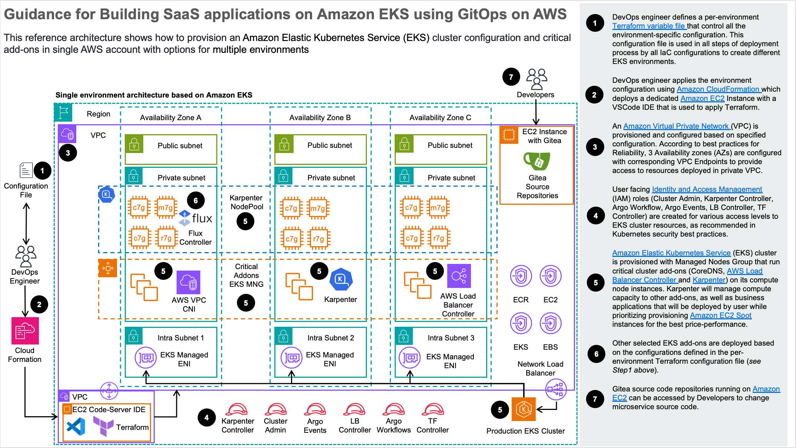
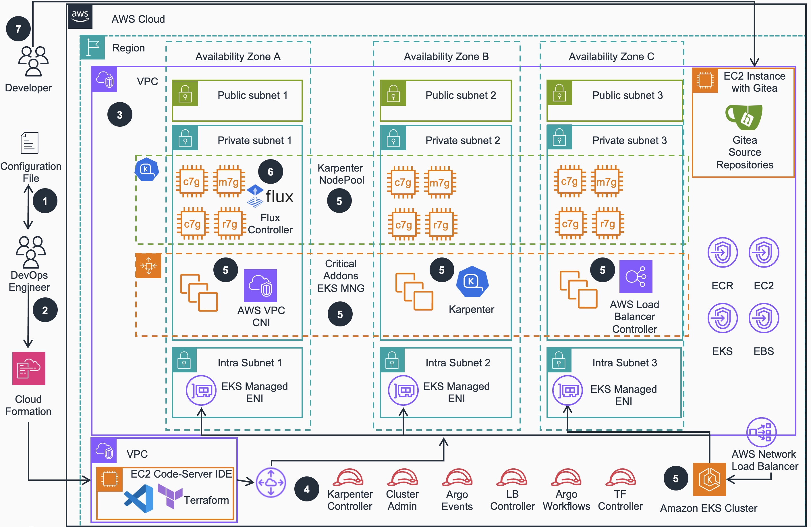

# Guidance for Building SaaS applications on Amazon EKS using GitOps

## Table of Contents

1. [Overview](#overview)
   - [Features and Benefits](#features-and-benefits)
   - [Use cases](#use-cases)
   - [Architecture](#architecture-overview)
   - [AWS services in this Guidance](#aws-services-in-this-guidance)
   - [Cost](#cost)
2. [Prerequisites](#prerequisites)
   - [Supported AWS Regions](#supported-aws-regions)
   - [Service Quotas](#service-quotas)
3. [Deployment Steps](#deployment-steps)
4. [License](#license)

## Overview

The "Building SaaS applications on Amazon EKS using GitOps" workshop and guidance provide a comprehensive template for implementing GitOps practices in a multi-tenant SaaS environment using Amazon Elastic Kubernetes Service (EKS). This repository serves as a foundation to generate multiple component repositories, enabling a hands-on GitOps experience. It contains all the necessary patterns, configurations, and scripts to deploy a scalable Software-as-a-Service (SaaS) application.

This guidance addresses the following key points:

- Provides a simplified process for setting up a GitOps workflow for SaaS applications on EKS
- Includes pre-configured templates and scripts for tenant onboarding and management
- Aims to reduce the learning curve associated with implementing GitOps in a SaaS context
- Allows users to focus on SaaS-specific concerns rather than infrastructure setup

The motivation behind this project is to accelerate and simplify the process of implementing GitOps practices in a SaaS environment. We've heard from customers that there can be a learning curve associated with deploying multi-tenant applications using GitOps principles. This project aims to simplify the undifferentiated lifting, allowing you to focus on your SaaS business logic.

## Features and Benefits

1. **Automated Tenant Onboarding**: Streamline the process of adding new tenants to your SaaS application with automated workflows and GitOps principles.

2. **Multi-Repository Structure**: Leverage a well-organized multi-repository structure that separates concerns and enables independent deployment of components.

3. **Environment-Specific Customization**: Easily tailor configurations for different environments (dev, staging, prod), enabling flexible and consistent multi-environment setups.

4. **Integrated Microservices**: Benefit from pre-integrated microservices templates that demonstrate communication patterns in a multi-tenant environment.

5. **Best Practices Implementation**: Automatically apply AWS, Kubernetes, and GitOps best practices, enhancing security, performance, and operational efficiency.

6. **Terraform-Based Deployment**: Utilize Terraform for infrastructure-as-code deployment, ensuring reproducibility and easier management of configurations across environments.

## Use Cases

1. **Accelerating SaaS Application Development on Kubernetes**
   Streamlining the development and deployment of multi-tenant applications on Amazon EKS using GitOps principles.

2. **Implementing Tenant Isolation in SaaS Applications**
   Demonstrating patterns for secure tenant isolation within a shared Kubernetes infrastructure.

3. **Automating Tenant Onboarding Workflows**
   Providing automated processes for adding new tenants to a SaaS application with minimal manual intervention.

4. **Consistent Multi-Environment Setup for SaaS Applications**
   Facilitating uniform deployments across dev, staging, and production for multi-tenant applications.

5. **Adopting GitOps for SaaS Application Management**
   Implementing GitOps methodologies for managing the lifecycle of SaaS applications on Kubernetes.

## Architecture Overview

This repository is organized to facilitate a hands-on deploymemt and learning experience, structured as follows:

- **`/gitops`**: Contains GitOps configurations and templates for setting up the application plane, clusters, control plane, and infrastructure necessary for the SaaS architecture.
- **`/helpers`**: Includes CloudFormation templates to assist in setting up the required AWS resources. (Used for deploying a VSCode server instance needed for setup)
- **`/helm-charts`**: Houses Helm chart definitions for deploying tenant-specific resources within the Kubernetes cluster and shared services resources.
- **`/tenant-microservices`**: Contains the source code and Dockerfiles for the sample microservices used in the workshop (consumer, payments, producer).
- **`/terraform`**: Features Terraform modules and scripts for provisioning the AWS infrastructure and Kubernetes resources. Detailed setup instructions are provided within this folder's README.md.
- **`/workflow-scripts`**: Provides scripts to automate the workflow for tenant onboarding and application deployment within the GitOps framework.

### Architecture Diagram

<!--  -->


*Figure 1: SaaS applications on Amazon EKS using GitOps - Reference Architecture*

### Architecture Steps
<!--
1. DevOps engineer defines a per-environment Terraform variable file that control all of the environment-specific configuration. This configuration file is used in all steps of deployment process by all IaC configurations to create different EKS environments.

2. DevOps engineer applies the environment configuration using Terraform with AWS EKS Blueprints following the deployment process defined in the guidance.

3. An Amazon Virtual Private Network (VPC) is provisioned and configured based on specified configuration. According to best practices for Reliability, 3 Availability zones (AZs) are configured with corresponding VPC Endpoints to provide access to resources deployed in private VPC.

4. User facing Identity and Access Management (IAM) roles (Cluster Admin, Karpenter Controller, Argo Workflow, Argo Events, LB Controller, TF Controller) are created for various access levels to EKS cluster resources, as recommended in Kubernetes security best practices.

5. Amazon Elastic Kubernetes Service (EKS) cluster is provisioned with Managed Nodes Group that run critical cluster add-ons (CoreDNS, AWS Load Balancer Controller and Karpenter) on its compute node instances. Karpenter will manage compute capacity to other add-ons, as well as business applications that will be deployed by user while prioritizing provisioning Amazon EC2 Spot instances for the best price-performance.

6. Other selected EKS add-ons are deployed based on the configurations defined in the per-environment Terraform configuration file (see Step1 above).

7. Gitea source code repository running on Amazon EC2 instance can be accessed by Developers to change microservice source code.
-->
1. DevOps engineer defines a per-environment Terraform variable file that controls environment-specific configuration. This configuration file is used in all steps of deployment process by various configurations to provision different EKS environments.
2. DevOps engineer applies the environment configuration using Amazon CloudFormation which deploys a Amazon EC2 Instance with a VSCode IDE that is used to apply Terraform.
3. An Amazon Virtual Private Network (VPC) is provisioned and configured based on specified configuration. According to best practices for Reliability, 3 Availability zones (AZs) are configured with corresponding VPC Endpoints to provide access to resources deployed in private VPC and other VPC connected by VPC Peering .
4. User facing Identity and Access Management (IAM) roles (Cluster Admin, Karpenter Controller, Argo Workflow, Argo Events, LB Controller, TF Controller) are created for various EKS cluster resources access levels , per Kubernetes security best practices.
5. Amazon Elastic Kubernetes Service (EKS) cluster is provisioned with Managed Nodes Group (MNG) that run critical cluster add-ons (CoreDNS, AWS Load Balancer Controller and Karpenter) on its compute node instances. Karpenter will manage compute capacity to other add-ons, as well as business applications that will be deployed by user while prioritizing provisioning Amazon EC2 Spot instances for the best price-performance. 
6. Other important EKS add-ons (Flux controller etc.) are deployed based on the configurations defined in the per-environment Terraform configuration file (see Step 1 above).
7. Gitea source code repositories running on Amazon EC2 can be accessed by Developer users to update microservices source code.

### AWS Services in this Guidance

| **AWS Service** | **Role** | **Description** |
|-----------------|----------|-----------------|
|[Amazon Elastic Kubernetes Service](https://aws.amazon.com/eks/) ( EKS) | Core service | Manages the Kubernetes control plane and worker nodes for container orchestration. |
| [Amazon Elastic Compute Cloud](https://aws.amazon.com/ec2/) (EC2) | Core service | Provides the compute instances for EKS worker nodes and runs containerized applications. |
| [Amazon Virtual Private Cloud](https://aws.amazon.com/vpc/) (VPC) | Core Service | Creates an isolated network environment with public and private subnets across multiple Availability Zones. |
| [Amazon Elastic Container Registry](http://aws.amazon.com/ecr/) (ECR) | Supporting service | Stores and manages Docker container images for EKS deployments. |
| [Amazon Elastic Load Balancing](https://aws.amazon.com/elasticloadbalancing/) (ELB) | Supporting service | Distributes incoming traffic across multiple targets in the EKS cluster. |
| [AWS Identity and Access Management](https://aws.amazon.com/iam/) (IAM) | Supporting service | Manages access to AWS services and resources securely, including EKS cluster access. |
| [AWS Certificate Manager](https://aws.amazon.com/certificate-manager/) (ACM) | Security service | Manages SSL/TLS certificates for secure communication within the cluster. |
| [Amazon CloudWatch](https://aws.amazon.com/cloudwatch/) | Monitoring service | Collects and tracks metrics, logs, and events from EKS and other AWS resources provisoned in the guidance |
| [AWS Systems Manager](https://aws.amazon.com/systems-manager/) | Management service | Provides operational insights and takes action on AWS resources. |
| [AWS Key Management Service](https://aws.amazon.com/kms/) (KMS) | Security service | Manages encryption keys for securing data in EKS and other AWS services. |
| [AWS CodeBuild](https://aws.amazon.com/codebuild/) | CI/CD service | Compiles/builds source code, runs tests, and produces software packages ready for deployment. |
| [AWS CodePipeline](https://aws.amazon.com/codepipeline/) | CI/CD service | Automates the build, test, and deployment phases of release process. |
[Amazon Managed Grafana](https://aws.amazon.com/grafana/) (AMG) | Observability service | Provides fully managed  service for metrics visualization and monitoring. |
| [Amazon Managed Service for Prometheus](https://aws.amazon.com/prometheus/) (AMP) | Observability service | Offers managed Prometheus-compatible monitoring for container metrics. |

<!--
| Amazon EKS | Core service | Manages the Kubernetes control plane and worker nodes for container orchestration. |
| Amazon EC2 | Core service | Provides the compute instances for EKS worker nodes and runs containerized applications. |
| Amazon VPC | Core Service | Creates an isolated network environment with public and private subnets across multiple Availability Zones. |
| Amazon ECR | Supporting service | Stores and manages Docker container images for EKS deployments. |
| AWS IAM | Supporting service | Manages access to AWS services and resources securely, including EKS cluster access. |
| AWS CodeBuild | CI/CD service | Compiles source code, runs tests, and produces software packages ready for deployment. |
| AWS CodePipeline | CI/CD service | Automates the build, test, and deployment phases of your release process. |
| AWS Systems Manager | Management service | Provides operational insights and takes action on AWS resources. |
| AWS Key Management Service | Security service | Manages encryption keys for securing data in EKS and other AWS services. |
-->
## Cost

You are responsible for the cost of the AWS services used while running this guidance. 
As of September 2025, the cost for running this guidance with the default settings in the US East (N. Virginia) Region `us-east-1` is approximately **$329.25/month**.

We recommend creating a [budget](https://alpha-docs-aws.amazon.com/awsaccountbilling/latest/aboutv2/budgets-create.html) through [AWS Cost Explorer](http://aws.amazon.com/aws-cost-management/aws-cost-explorer/) to help manage costs. Prices are subject to change. For full details, refer to the pricing webpage for each AWS service used in this guidance.

### Sample cost table

The following table provides a sample cost breakdown for deploying this guidance with the default parameters in the `us-east-1` (N. Virginia) Region for one month. This estimate is based on the AWS Pricing Calculator output for the full deployment as per the guidance.

| **AWS service** | Dimensions | Cost, month [USD] |
|-----------------|------------|-------------------|
| Amazon EKS | 1 cluster | $73.00 |
| Amazon EC2 | 2 m6g.large instances | $57.81 |
| Amazon EC2 | 1 t3.large instance (VSCode Server) | $64.74 |
| Amazon EC2 | 1 t2.micro instance (Gitea) | $10.47 |
| Amazon ECR | Image storage and data transfer | $25.00 |
| Application Load Balancer | 1 ALB for workloads | $18.03 |
| Amazon VPC | Public IP addresses, NAT Gateway | $70.20 |
| AWS Key Management Service (KMS) | Keys and requests | $7.00 |
| Amazon CloudWatch | Metrics | $3.00 |
| **TOTAL** |  | **$329.25/month** |

For a more accurate estimate based on your specific configuration and usage patterns, we recommend using the [AWS Pricing Calculator](https://calculator.aws/#/estimate?id=44e4bfe114a562642dd1002fdc101c4c15433fe3).

## Supported AWS Regions

The core components of the Guidance for EKS SaaS GitOps are available in all AWS Regions where Amazon EKS is supported.

The observability components of this guidance use Amazon Managed Service for Prometheus (AMP) and Amazon Managed Grafana (AMG). These services are available in the following regions:

| Region Name | Region Code |
|-------------|-------------|
| US East (N. Virginia) | us-east-1 |
| US East (Ohio) | us-east-2 |
| US West (Oregon) | us-west-2 |
| Asia Pacific (Mumbai) | ap-south-1 |
| Asia Pacific (Seoul) | ap-northeast-2 |
| Asia Pacific (Singapore) | ap-southeast-1 |
| Asia Pacific (Sydney) | ap-southeast-2 |
| Asia Pacific (Tokyo) | ap-northeast-1 |
| Europe (Frankfurt) | eu-central-1 |
| Europe (Ireland) | eu-west-1 |
| Europe (London) | eu-west-2 |
| Europe (Stockholm) | eu-north-1 |
| South America (São Paulo) | sa-east-1 |


### Regions Supporting Core Components Only

The core components of this guidance can be deployed in any AWS Region where Amazon EKS is available. This includes all commercial AWS Regions except for the Greater China Regions and the AWS GovCloud (US) Regions.

For the most current availability of AWS services by Region, refer to the [AWS Regional Services List](https://aws.amazon.com/about-aws/global-infrastructure/regional-product-services/).

>Note: If you deploy this guidance into a region where AMP and/or AMG are not available, you can disable the OSS observability tooling during deployment. This allows you to use the core components of the guidance without built-in observability features.

### Service Quotas

**NOTICE**
Service quotas, also referred to as limits, are the maximum number of service resources or operations for your AWS account.

### Quotas for AWS services in this Guidance

Ensure you have sufficient quota for each of the AWS services utilized in this guidance. For more details, refer to [AWS service quotas](https://docs.aws.amazon.com/general/latest/gr/aws_service_limits.html).

If you need to view service quotas across all AWS services within the documentation, you can conveniently access this information in the [Service endpoints and quotas](https://docs.aws.amazon.com/general/latest/gr/aws-general.pdf#aws-service-information) page in the PDF.

For specific implementation quotas, consider the following key components and services used in this guidance:

- **Amazon EKS**: Ensure that your account has sufficient quotas for Amazon EKS clusters, node groups, and related resources.
- **Amazon EC2**: Verify your EC2 instance quotas, as EKS node groups rely on these.
- **Amazon VPC**: Check your VPC quotas, including subnets and Elastic IPs, to support the networking setup.
- **Amazon EBS**: Ensure your account has sufficient EBS volume quotas for persistent storage.
- **IAM Roles**: Verify that you have the necessary quota for IAM roles, as these are critical for securing your EKS clusters.
- **AWS Systems Manager**: Review the quota for Systems Manager resources, which are used for operational insights and management.
- **AWS Secrets Manager**: If you're using Secrets Manager for storing sensitive information, ensure your quota is adequate.

## Security

When you build systems on AWS infrastructure, security responsibilities are shared between you and AWS. This [shared responsibility model](https://aws.amazon.com/compliance/shared-responsibility-model/) reduces your operational burden because AWS operates, manages, and controls the components including the host operating system, the virtualization layer, and the physical security of the facilities in which the services operate. For more information about AWS security, visit [AWS Cloud Security](https://aws.amazon.com/security/).

This guidance implements several security best practices and AWS services to enhance the security posture of your EKS SaaS GitOps environment. Here are the key security components and considerations:

### Identity and Access Management (IAM)

- **IAM Roles**: The architecture uses predefined IAM roles (Cluster Admin, Karpenter Controller, Argo Workflow, Argo Events, LB Controller, TF Controller) to manage access to the EKS cluster resources. This follows the principle of least privilege, ensuring users and services have only the permissions necessary to perform their tasks.

- **EKS Managed Node Groups**: These use IAM roles with specific permissions required for nodes to join the cluster and for pods to interact with AWS services.

- **RBAC Configuration**: Role-Based Access Control is implemented within Kubernetes to provide granular access management for cluster resources.

### Network Security

- **VPC Configuration**: The solution deploys resources into a Virtual Private Cloud with 3 Availability Zones (AZs) and corresponding VPC Endpoints to provide secure access to resources deployed in private VPC segments.

- **Security Groups**: Security groups are configured to restrict traffic between components based on the principle of least privilege.

- **Network Policies**: Kubernetes network policies are implemented to control pod-to-pod communication within the cluster.

### Data Protection

- **Encryption**: All data at rest and in transit is encrypted using AWS KMS customer managed keys (CMKs) and TLS, respectively.

- **Secrets Management**: Sensitive information is stored securely using Kubernetes secrets and AWS Secrets Manager.

### Monitoring and Logging

- **CloudWatch Integration**: The solution integrates with Amazon CloudWatch for monitoring and logging of EKS cluster activities.

- **Audit Logging**: Kubernetes audit logging is enabled to track actions performed within the cluster.

### Tenant Isolation

- **Multi-Tenancy Security**: The solution implements strong tenant isolation with separate namespaces, network policies, and resource quotas for each tenant.

### Secure Deployment

- **GitOps Approach**: The GitOps methodology ensures that all changes to the infrastructure and applications are version-controlled, reviewed, and auditable.

- **Source Code Security**: Gitea source code repository running on Amazon EC2 instance provides secure access controls for developers changing microservice source code.

## Prerequisites

Before deploying this guidance, please ensure you have met the following prerequisites:

1. **AWS Account and Permissions**: Ensure you have an active AWS account with appropriate permissions to create and manage AWS resources like Amazon EKS, EC2, IAM, and VPC.

Note: All required tools (AWS CLI, Terraform, Git, kubectl, Helm, and Flux CLI) are pre-installed in the VSCode server instance that will be deployed as part of the setup process.

## Deployment Steps

Follow these steps to deploy the EKS SaaS GitOps guidance:

1. **Deploy the VSCode Server Instance**:
   - Navigate to the AWS CloudFormation console in your AWS account
   - Click "Create stack" and select "With new resources (standard)"
   - Choose "Upload a template file" and upload the `helpers/vs-code-ec2.yaml` file from this repository
   - Click "Next" and provide a stack name (e.g., "eks-saas-gitops-vscode")
   - Configure any required parameters and click "Next"
   - **Note**: The default allowed IPs is set to 0.0.0.0/0 (all IP addresses). For production deployments, consider restricting this to specific IP ranges for enhanced security.
   - Review the configuration and click "Create stack"
   - Wait for the CloudFormation stack to complete deployment (approximately 30 minutes)
   - The Terraform infrastructure is deployed automatically as part of the VSCode server instance setup
   - The VSCode instance has all required tools pre-installed (AWS CLI, Terraform, Git, kubectl, Helm, and Flux CLI)

2. **Access the VSCode Server Instance**:
   - Once the CloudFormation stack deployment is complete, go to the "Outputs" tab
   - Find the `VsCodePassword` and click on the link, copy the password under `Value`
   - Find the `VSCodeURL` output value and click on the link
   - This will open the VSCode web interface in your browser
   - Input the password copied from `VsCodePassword`
   - The initial guidance repository (this repository) will be available at `/home/ec2-user/eks-saas-gitops`
   - The repository connected to Flux and your Amazon EKS Cluster will be automatically cloned and available in the VSCode workspace at `/home/ec2-user/environment/gitops-gitea-repo`
   - If you want to understand the infrastructure components or make customizations, you can review the terraform directory:
     ```
     cd /home/ec2-user/eks-saas-gitops/terraform
     ```
   - The `/home/ec2-user/eks-saas-gitops` is the initial guidance repo used to create the entire Stack, while `/home/ec2-user/environment/gitops-gitea-repo` is the Gitea repo connected to Flux and the EKS Cluster.

4. **Explore the GitOps Implementation**:
   - After the infrastructure deployment is complete, you can explore the GitOps implementation and tenant onboarding process
   - The sample microservices and Helm charts are available in their respective directories
   - Use the workflow scripts to automate tenant onboarding and application deployment

**TODO: update to live IG link when available and comment out the steps above**
Please refer to detailed deployment instructions in the detailed guidance [Implementation Guide](https://implementationguides.kits.eventoutfitters.aws.dev/saas-eks-0307/compute/building-saas-applications-on-amazon-eks-using-gitops.html#deploy-the-guidance)

## Cleanup and Destruction

When you're finished with the workshop/guidance use or need to clean up the resources to avoid ongoing costs, you can use the provided destruction script.

### Running the Destroy Script

Navigate to the terraform directory and run the destroy script with your desired AWS region as a parameter:
```bash
cd /home/ec2-user/eks-saas-gitops/terraform
```
```bash
sh destroy.sh <AWS_REGION>
```

**Example:**

```bash
# Destroy resources in us-east-1
./destroy.sh us-east-1
```

The destroy script will:
- Clean up ECR repositories and their images
- Remove EKS node groups and cluster resources
- Destroy VPC and networking components
- Clean up IAM roles and policies
- Remove all other infrastructure components created during deployment

**TODO: update to live IG link when available comment out the steps above**
Please refer to detailed guidance cleanup instructions in the detailed guidance [Implementation Guide](https://implementationguides.kits.eventoutfitters.aws.dev/saas-eks-0307/compute/building-saas-applications-on-amazon-eks-using-gitops.html#uninstall-the-guidance)

**Important:** The destruction process may take 15-20 minutes to complete. Ensure you have the necessary AWS permissions to delete all the resources that were created during the initial deployment.

## License

This project is licensed under the terms of the [MIT-0 license](LICENSE).

## Contributing

Your contributions are welcome! If you'd like to improve the workshop/guidance or suggest changes, please feel free to submit issues or pull requests.

We value your input and contributions! Please review our [Code of Conduct](CODE_OF_CONDUCT.md) and [Contributing Guidelines](CONTRIBUTING.md) for how to participate in making this project better.
